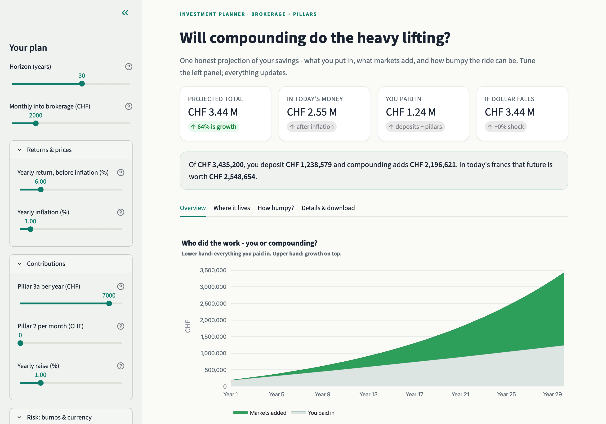
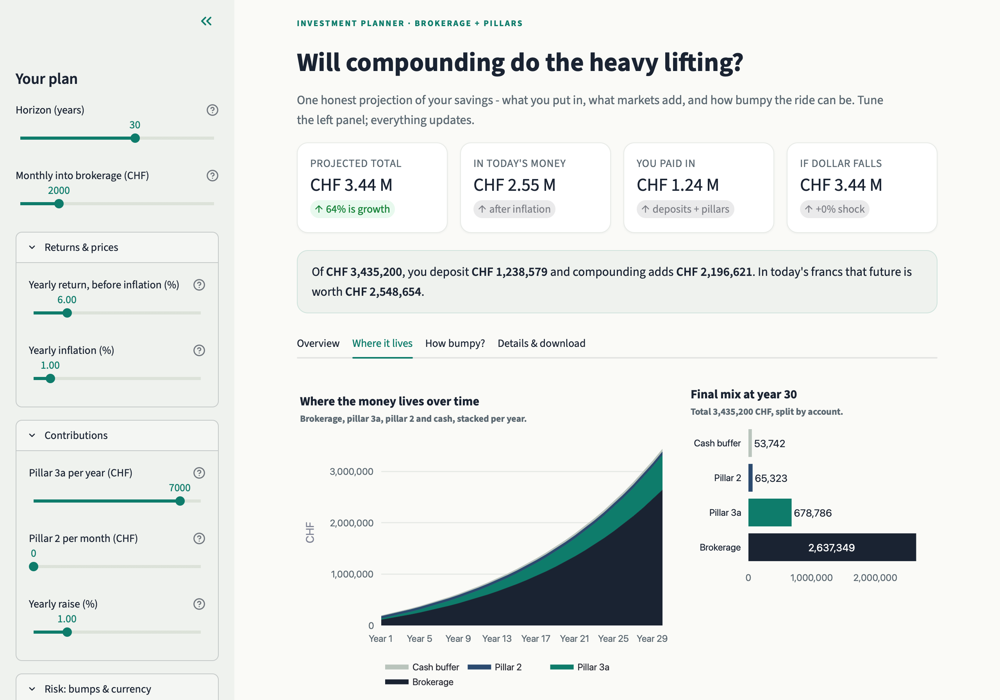
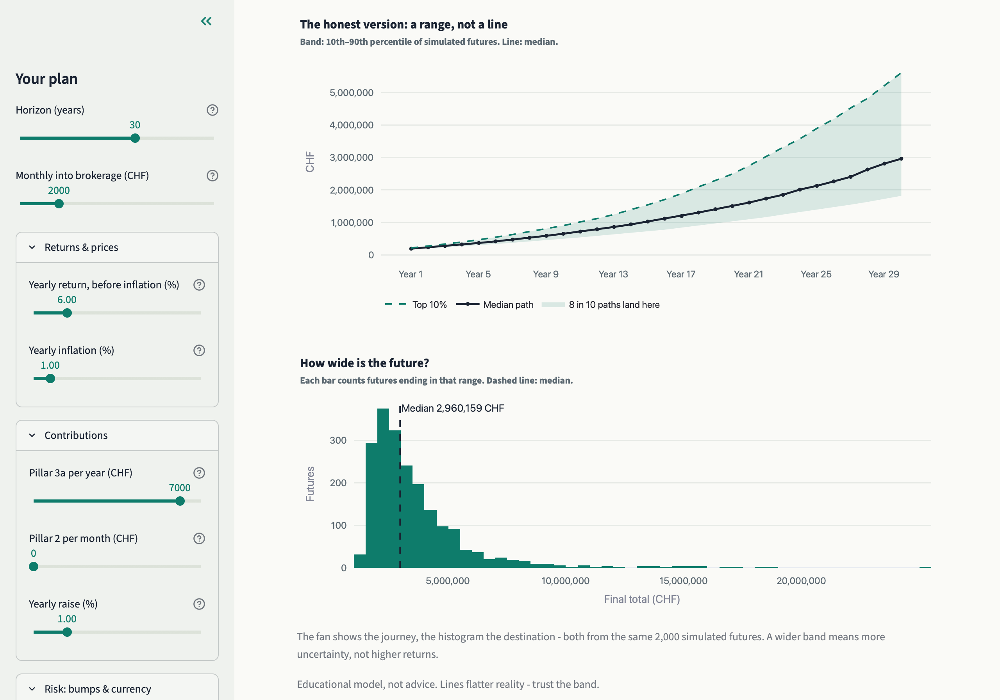
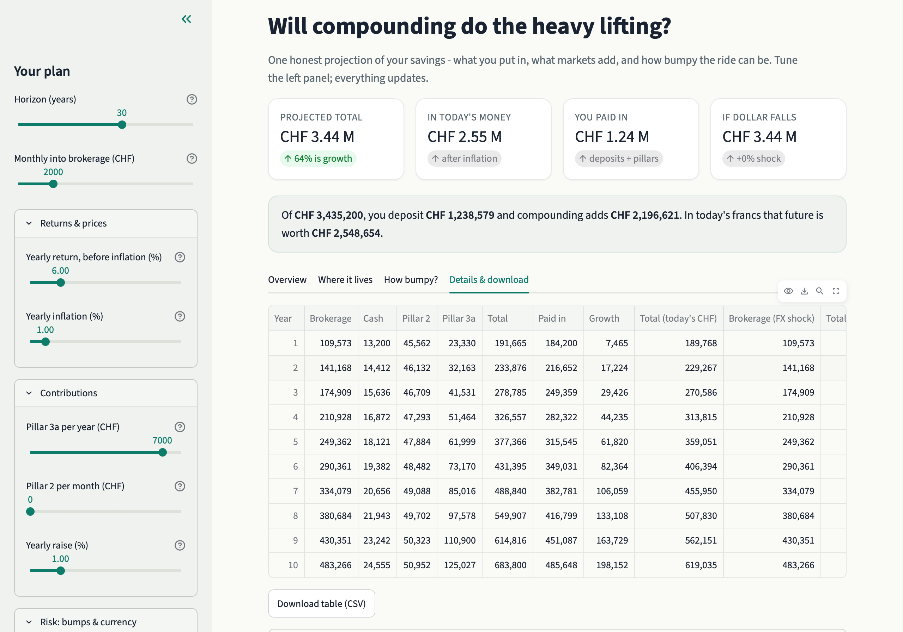

# Snowball

Long-term planning toolkit for the taxable-brokerage + cash + pillar 2/3a case. Deterministic projection, bull/base/bear scenarios, Monte Carlo fan, FX shocks, withdrawal sketch, interactive Plotly HTML + Streamlit app, CSV/XLSX export.

## Screenshots

The live app, running on fictional demo data (`config.demo.yaml`) — reproduce with:

```bash
cp config.demo.yaml config.yaml  # in a scratch copy only; never overwrite your real one
uv run streamlit run app.py
```

| Overview: KPIs, insight bar, compounding chart       | Where it lives: net worth by wrapper                     |
| ---------------------------------------------------- | -------------------------------------------------------- |
|        |  |
| How bumpy?: Monte Carlo fan and outcome distribution | Details: yearly table with CSV download                  |
|       |          |

## Quickstart

```bash
uv sync --extra dev
cp config.example.yaml config.yaml  # then fill in your numbers (config.yaml is git-ignored)
uv run snowball --years 38 --verbose --export-csv reports/projection.csv --export-xlsx reports/plan.xlsx
# HTML charts -> reports/{stacked,wrappers,scenarios,fan,histogram}.html
uv run pytest
uv run streamlit run app.py
```

Config lives in `config.yaml` - edit salary, balances, expected return, inflation, pillar 2/3a, volatility, FX shock.

## Assumptions

**What an "expected return" is.**

A planning input, not a prediction: one honest number for what the brokerage portfolio earns per year, after fund costs, before inflation (5-7% for an equity-heavy mix). It lives in `config.yaml` as `expected_return_annual`, adjustable in the sidebar, and bounded by the bull/bear scenarios instead of decomposed per holding. Returns decompose as:

$$
\text{past return} = \text{dividend yield} + \text{earnings growth} \pm \text{multiple change}
$$
where:
- **past return** is the total return you actually saw in your brokerage account last year (or over the last 10 years, or since inception).
- **dividend yield** is the cash you actually received, which you can reinvest or spend.
- **earnings growth** is the actual change in the underlying business value, which you can reinvest or spend.
- **multiple change** is the change in the market's valuation of the underlying business, which you cannot reinvest or spend.

Only the first two repeat. Multiple expansion is a one-time transfer from future returns to past returns - which is why a +25% year argues for *lower*, not higher, forward expectations. That is also why trailing price returns are never an input here: state 6% because you believe it, then stress it ±.

## Layout

```text
app.py                  # Streamlit composition root (sidebar + tabs)
src/snowball/
  charts.py             # Plotly figures + shared tooltip/palette design
  cli.py                # `investing` command (argparse + console output)
  config.py             # Pydantic models (Person/Balances/Assumptions/PlanConfig) + YAML loading
  engine.py             # pure simulation math, no file I/O
  formatting.py         # chf / chf_short
  reporting.py          # CSV + Excel exports
  ui.py                 # Streamlit theme CSS + slider/card/chart helpers
tests/                  # mirrors src: test_config / test_engine / test_charts
```

## Notes / limits

- Fund costs live inside your expected return (state it net). If you want to feel a fee change, move the number and watch the fan.
- Pillar 3a contributions are front-loaded each January.
- Monte Carlo draws `N(mean/12, vol/sqrt(12))` linear monthly returns on the brokerage sleeve only; pillars stay deterministic.
- FX shock is a linear drift `1 + shock * year/years` on the foreign share - a what-if, not a currency model.
- Pillar 2 compounds at a blended ~1.4% (1.25% guaranteed floor plus surplus participation); pillar 3a tracks equities minus its fee.
- *"Today's francs"* are deflated at your inflation setting (1% over 38 years ≈ ×0.68).
- No capital-gains tax (CH private assets), no stamp duty in 3a.
- Educational only, not financial advice.
